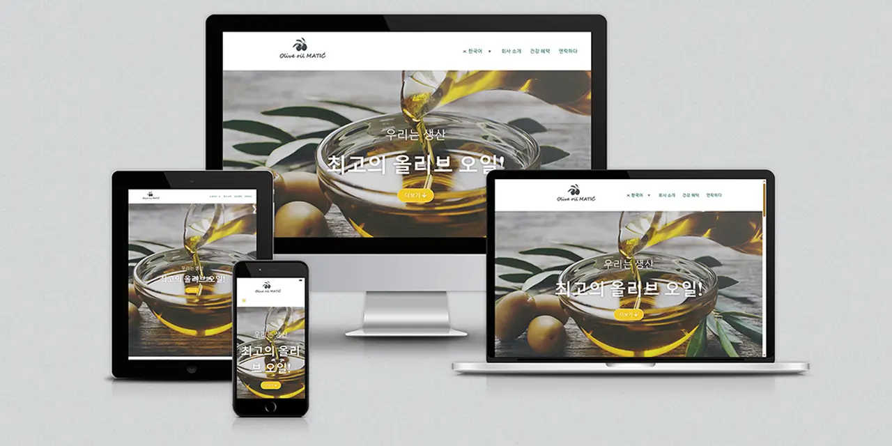

# Olive Oil Matic

A modern, responsive website developed for **Olive Oil Matic**, showcasing premium olive oil production equipment and solutions. The project focuses on clean design, responsive layouts, user experience, and performance optimization to provide an engaging browsing experience across all devices.

## 🌐 Live Website

https://oliveoilmatic.com

---

## 📖 Overview

This project was designed and developed to create a professional online presence for Olive Oil Matic. The website combines a clean visual identity with responsive design principles, intuitive navigation, and optimized performance.

The layout adapts seamlessly to desktop, laptop, tablet, and mobile devices while maintaining consistent branding and usability.

---

## ✨ Features

- Fully responsive design
- Modern and professional user interface
- Mobile-first layout
- Optimized performance
- SEO-friendly structure
- Cross-browser compatibility
- Clean navigation
- Optimized images
- Accessibility-focused design

---

## 🛠 Technologies Used

### CMS

- WordPress

### Page Builder

- Elementor

### Frontend

- HTML5
- CSS3
- JavaScript
- jQuery

### WordPress Plugins

- Elementor
- Contact Form 7
- Polylang
- Connect Polylang for Elementor
- Multilingual Contact Form 7 with Polylang
- All in One SEO
- WP Mail SMTP
- Insert Headers and Footers
- Limit Login Attempts Reloaded

### Design & Optimization

- Adobe Photoshop
- Responsive Web Design
- UI/UX Design
- SEO Optimization
- Performance Optimization

---

## 📱 Responsive Design

The website is fully optimized for:

- Desktop
- Laptop
- Tablet
- Mobile

ensuring an excellent user experience across different screen sizes.

---

## 🚀 Performance

Performance optimization includes:

- Optimized images
- Efficient asset loading
- Responsive image delivery
- Clean HTML structure
- Optimized CSS and JavaScript

---

## 🔍 SEO

The website follows modern SEO best practices, including:

- Semantic HTML
- Optimized metadata
- Proper heading hierarchy
- Responsive design
- Performance optimization
- Search engine friendly structure

---

## 🖼 Preview

---

## 👨‍💻 Author

**Mirnes Glamočić**

Full-Stack Web Developer • UI/UX Designer

🌐 https://mirnesglamocic.com

💼 https://www.linkedin.com/in/mirnesglamocic

🐙 https://github.com/full-stack-web-developer-and-designer

---

## 📄 License

This project is presented as part of my professional portfolio.

© 2026 Mirnes Glamočić. All rights reserved.